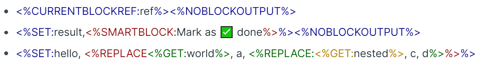

# Overview

Commands are the **Smartness** of SmartBlocks Workflows. Instead of outputting the same raw text, they are dynamic and resolve to new text. They could also perform various side effects on your graph, pull data from third party APIs, and be custom built by users.

Commands are specially formatted. It must match this syntax in order to execute in your workflow. Here is an example of a command:

- **<%DATE:in two weeks%>**

Let's break this down into its components:

1. `<%` - Each command starts with this delimiter
2. `DATE` - The name of the command, provided in all upper case letters.
3. `:` - A colon delimiting the command name from its additional parameters. Many, but not all, commands accept additional parameters. You may omit this if the command does not.
   - For example, `<%TIME%>`
4. `in two weeks` - The command parameters follow the command name. Unless otherwise specified, all commands use a comma (`,`) to separate multiple parameters.
5. `%>` - Each command ends with this delimiter

# Command Resolution

Commands resolve in block order, in the order they appear in the block. Commands could also be nested, where some commands could serve as inputs to other commands. In this case, the nested commands resolve first, before the outer commands.

Here's an example:

- `<%CONCAT:<%INPUT:First name%>, <%INPUT:Last name%>%> <%CURRENTPAGENAME%>`

These commands are resolved in the following order:

1. `<%INPUT:First name%>`
2. `<%INPUT:Last name%>`
3. `<%CONCAT:...%>`
4. `<%CURRENTPAGENAME%>`

# Command Auto Complete

When typing `<%` into a block in Roam, an autocomplete menu will appear. This is to help insert commands into the graph. Clicking on one will generate a help message appearing on the bottom right of the screen with more info on what that command does.

# Command Highlighting

It could get very difficult reading tons of nested commands. To help with this, you could enable `Command Highlighting` from the Roam Depot Settings for Smartblocks tab. The result will give commands different nested colors to make it easier to read!

