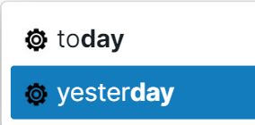
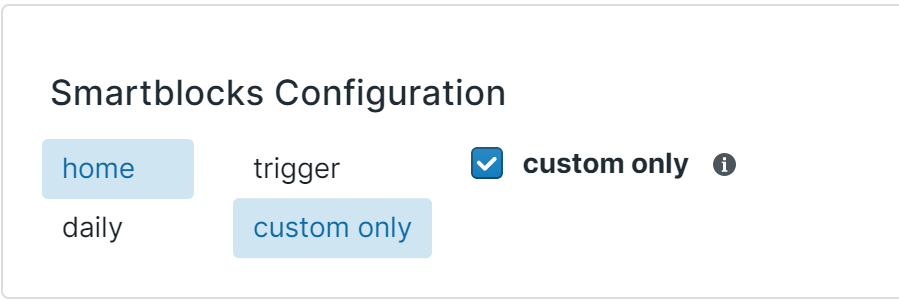

# Overview

SmartBlocks includes a number of predefined workflows out of the box. Each of them represents a quick SmartBlock template for common functionality. To use these predefined workflows, simply type the keystrokes in the trigger. Predefined workflows will be prefixed with a gear icon.

## Predefined Workflows

## Helper Workflows

**Action:** Quickly lay out the template for making a new smartblock

**Workflows:** Workflow SmartBlock Starter, Button SmartBlock Starter (Coming Soon...)

## Date Insertion Commands

**Action: **For each day of the week, insert this week's date, last week's date, next week's date

**Workflows:** Monday, Last Monday, Next Monday (and so on for each day of week)

## Time

**Action: **Inserts time (there is a 24 hour version and AM PM version)

**Workflows:** Time, Time AM/PM

## Serendipity - Random Block

**Action:** Inserts a random block from your database

**Workflows:** Serendipity - Random Block (you can also just type the word "random"

## TODO lists

**Action:** inserts a list of block references of your TODO's. Useful to get a list of relevant TODOs from your graph

**Workflows:** TODO - and select from the TODO list options below:

- TODO's for today (TODO blocks that `[[reference todays date]]`)
- TODO's that are overdue (TODO blocks that `[[reference dates before today]]`)
- TODO's that are overdue DNP (TODO blocks that `[[reference dates before today]]` and any TODO on a Daily Notes Page for a previous date)
- TODO's that are in the future (TODO blocks that `[[reference dates before today]]`)
- TODO's that are in the future DNP (TODO blocks that `[[reference dates before today]]` and any TODO on a Daily Notes Page for a future date)
- TODO's that are undated (TODO blocks that don't `[[reference dates]]`)

## Block Mentions

Coming Soon...

**Action:** Inserts blocks referencing an input page

**Workflows:** Block Mentions List

## Search

Coming Soon...

**Action:** Searches for blocks that includes a given piece of text

**Workflows:** Search - plain text

# Customization:

By default, all pre-defined workflows are included in the smart blocks menu after opening via the trigger. If you would like to exclude the pre-defined workflows so that only the custom ones are shown, head to the Smartblocks tab in your Roam Depot Setting enable the `Custom Only` option. You will need to refresh Roam after checking this option for the setting to take effect.

