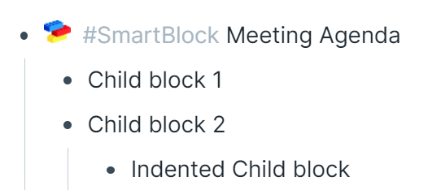
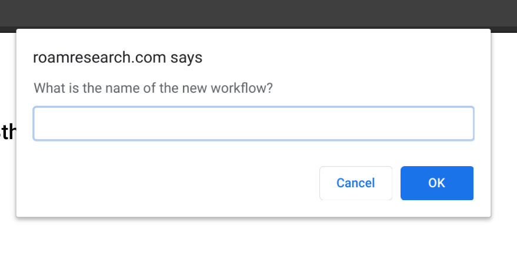

# Table of Contents

1. [Trigger Your Workflow](010-trigger-your-workflow.md)
2. [Understanding Commands](020-understanding-commands.md)
3. [Using Pre-Defined Workflows](030-using-pre-defined-workflows.md)
4. [Make Your Own Workflows](040-make-your-own-workflows.md)
5. [Command Reference](050-command-reference.md)
6. [Alternative Methods](060-alternative-methods.md)
7. [Developer Docs](070-developer-docs.md)

# Overview

- You can quickly turn just about anything in Roam into a workflow. Defining custom workflows accessible via the SmartBlocks Trigger is the primary use case of this extension.
- A SmartBlock workflow follows a number of simple rules outlined below. There is a `Workflow` SmartBlock to help you get started.

# Structure of a SmartBlocks:

A parent block on any page that has the tag `#SmartBlock` followed by the title defines a SmartBlock workflow. All child blocks are part of the workflow.

### Example

Here's what this SmartBlock is saying:

- `#SmartBlock` Meeting Agenda **(This is the parent block, it will not be inserted when the action is triggered. Search for "Meeting Agenda" to trigger)**
  - Child block 1 **(all text in this block will be inserted, replacing the trigger in the current block)**
  - Child block 2 **(this block of text will be inserted as a sibling of the previous block)** - Indented Child block **(this block will be inserted and indented)**

# Formatting

Any formatting will be included in the output of the workflow, such as `**` for bold, `__` for emphasizing, and so on. All text within the block is preserved.

Block level settings, such as headers, alignment, and view type are also preserved.

# Special Commands

Workflows can be "Smart" which means you can embed certain commands into your workflow to have it perform dynamic actions. See the [command reference]([[smartblocks/command_reference]]) for documentation on all of the supported commands.

### Example of SmartBlocks with commands

Description

- `#SmartBlock Meeting Agenda` **(Parent block, followed by children blocks)**
  - `Date: <%DATE:today%> <%TIME%>`
  - `<%IFDAYOFWEEK:1%> Monday detailed briefing`

## Helper Workflow

SmartBlocks includes a pre-defined workflow named **Workflow Starter**. It helps you start a new workflow quickly by inserting a template as a starting point. Visit [this section](030-using-pre-defined-Workflows.md) for a list of all the other pre-defined workflows.

