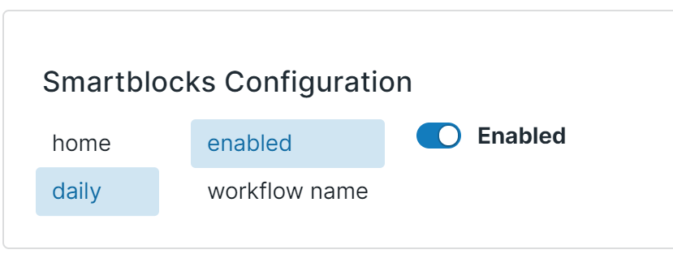
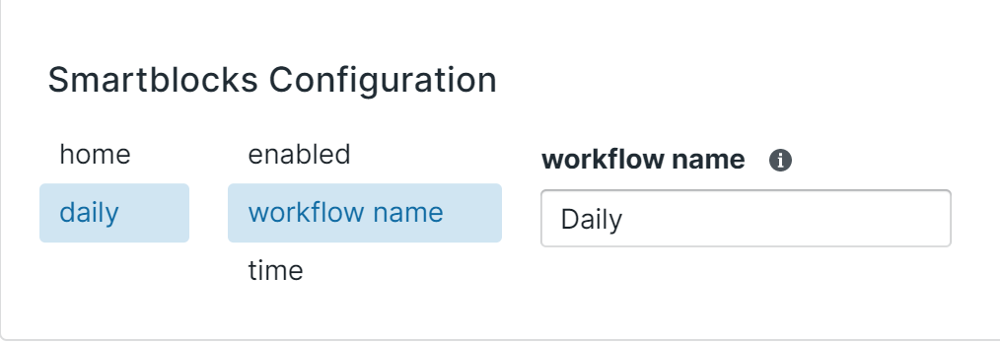
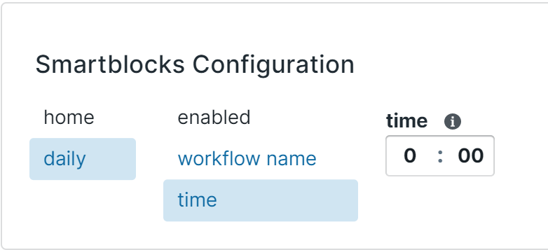
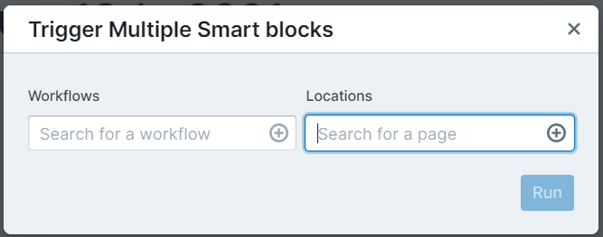
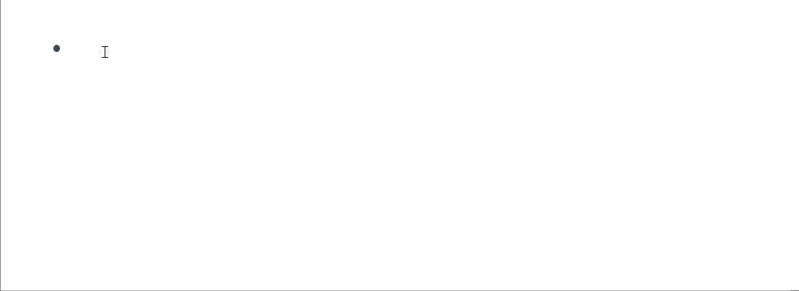
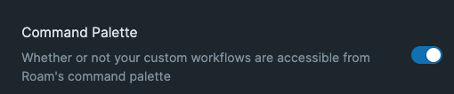

# Table of Contents

1. [Trigger Your Workflow](010-trigger-your-workflow.md)
2. [Understanding Commands](020-understanding-commands.md)
3. [Using Pre-Defined Workflows](030-using-pre-defined-workflows.md)
4. [Make Your Own Workflows](040-make-your-own-workflows.md)
5. [Command Reference](050-command-reference.md)
6. [Alternative Methods](060-alternative-methods.md)
7. [Developer Docs](070-developer-docs.md)

## Table of Contents

# Overview

Outside of the conventional [trigger](010-trigger-your-workflow.md), there are several other ways to use SmartBlocks!

# Daily Workflow

Many users have a daily template they trigger each day to populate their Daily Notes each day. You could configure a SmartBlock workflow to trigger automatically on to your Daily Notes Page!

Note that the Daily Note page for the current day must be empty for the workflow to trigger. If your daily workflow fails to trigger, simply clear the content on the current day and refresh Roam.

To turn on daily workflows, head to the Roam Depot Settings for Smartblocks and enable the `Daily` setting. Be sure that you have the `Workflow Name` setting filled and that you have a workflow in your graph defined that matches that name, which should default to use `Daily`. Now every day you load Roam, a chosen smart block workflow will trigger automatically onto your Daily Notes page!

By default, the workflow that gets triggered on your Daily Notes page is titled "Daily". You could change which workflow runs on your daily notes page by changing the `workflow name` setting in the `daily` tab:

By default, the workflow runs any time after midnight each day. If you would like to change the time when of when the workflow fires, you could change the `time` setting in the `daily` tab:

# SmartBlock Buttons

You can insert a button into a block so the button will run a SmartBlock workflow when the user clicks on it. To do this, insert a button using the following syntax:

- `{{caption:SmartBlock:workflow name}}`
- First, you notice the syntax starts with `{{` and also ends with `}}`
- Three parameters separated by a `:`
  1. **Caption** - the name that will appear on the button. (Do not use caption names that conflict with other Roam features, like: table, kanban, test)
  2. **SmartBlock** - this is the directive that tells SmartBlocks that this button is for a SmartBlock workflow. Please note: this must match exactly, including case.
  3. **Workflow Name** - the name of your workflow you want the button to run. The Workflow Name must match identically the name of the workflow in your graph
- You could add a fourth parameter (separated by a `:`). Each variable is delimited by a comma (`,`), with an equal sign (`=`) delimiting the variable name from the value.
  - **Example**: `{{caption:SmartBlock:workflow name:name=value,secondName=otherValue}}`
  - These variables are retrievable from the [GET command](050-command-reference.md#get).

The caption of the button is also available in the SmartBlock workflow under the variable `ButtonContent`.

## Predefined Variables

There are currently 6 predefined variables: `RemoveButton`, `Order`, `TargetRef`, `Clear`, `Sibling`, and `Icon`.

### Remove Button

By default, SmartBlock buttons are removed and the workflow will replace it with the template. If you would like to keep the SmartBlock button and nest the contents of the workflow as **children**, configure one of the variables in the button with name `RemoveButton` and value `false`.

**Example**

- `{{caption:SmartBlock:workflow name:RemoveButton=false}}`

### Order

When using `RemoveButton` is set to `false`, you can set the `Order` in which to insert the SmartBlock.

Default is 0. (which is first)
Use `last` to target the last block.

**Example**

- `{{caption:SmartBlock:workflow name:RemoveButton=false,Order=last}}`
-

### Target Ref

When using `RemoveButton` is set to `false`, you can set the UID of the block in which to run the SmartBlock on via `TargetRef`.

**Example**

- `{{caption:SmartBlock:workflow name:RemoveButton=false,TargetRef=((kZrX4zMQq))}}`

### Clear

By default, SmartBlock buttons will leave the text as is (of the block the button is running in). If you would like the text of the block cleared, set `Clear` to `true`

**Example**

- `{{caption:SmartBlock:workflow name:Clear=true}}`

### Sibling

To nest the contents of the workflow on an adjacent sibling block, use `Sibling=previous` or `Sibling=next`

**Example**

- `{{caption:SmartBlock:workflow name:Sibling=previous}}`

### Demo

Combinations of the above predefined variables are also accepted

**Example**

- `{{caption:SmartBlock:workflow name:RemoveButton=false,Clear=true,Sibling=next}}`

This button will not remove the Smartblock button, clear existing text on the block, and apply the contents of the workflow to the next sibling block.

**Video Demo**

https://github.com/RoamJS/smartblocks/assets/3792666/eed8027b-179d-437b-a0be-c88b1d577c6a

### Icon

By default, SmartBlock buttons display a lego icon. You can customize or disable this icon using the `Icon` parameter:

**Examples**

- `{{Today:SmartBlock:myWorkflow:Icon=false}}` - No icon will be displayed
- `{{Today:SmartBlock:myWorkflow:Icon=none}}` - No icon will be displayed
- `{{Today:SmartBlock:myWorkflow:Icon=clipboard}}` - Display a Blueprint.js clipboard icon
- `{{Today:SmartBlock:myWorkflow:Icon=refresh}}` - Display a Blueprint.js refresh icon

The Icon parameter accepts:

- `false` or `none` - Hides the icon completely
- Any valid [Blueprint.js icon name](https://blueprintjs.com/docs/versions/3/#icons) - Displays that Blueprint icon instead of the default lego icon
- When omitted - Shows the default lego icon

Note: The global "Hide Button Icon" setting overrides the `Icon` parameter.

# Bulk Trigger

You can run multiple SmartBlock workflows across multiple pages. In the Roam command palette, there will be an option called "Run Multiple SmartBlocks", which will open this dialog on click:

You could list any number of workflows and any number of pages. Upon clicking "Run", the workflows listed on the left column will run one page at a time on each of the pages on the right column.

If you trigger this command while the cursor's on a block, the locations side will prepopulate with all of the pages that are referenced by a child of that block.

# Hot Keys

On the Roam Depot Settings page for SmartBlocks, you could give hot keys to specific workflows to access them even quicker than before. There are two types of hot keys:

1. Global - These can be triggered anywhere. They are made up of a modifier key (control, shift, meta, or alt) and a single other key.
2. Input - These can be triggered only in blocks. They are made up of a sequence of single length keys (letters, numbers, etc.). Typing that sequence into a block will trigger the workflow

Here's an example of the second version with the hot key `smrt`.

The input field in the configuration page is a special input field. It will react exactly to the key presses you enter when configuring the hot key.

# Command Palette

You can surface all custom SmartBlock workflows to be triggered from the Roam Command Palette. To do so, head to the SmartBlocks Settings within RoamDepot, toggle on the command palette setting.

Each workflow will start with a prefix `Trigger SmartBlock:` with the name of the workflow at the end of the command label.
